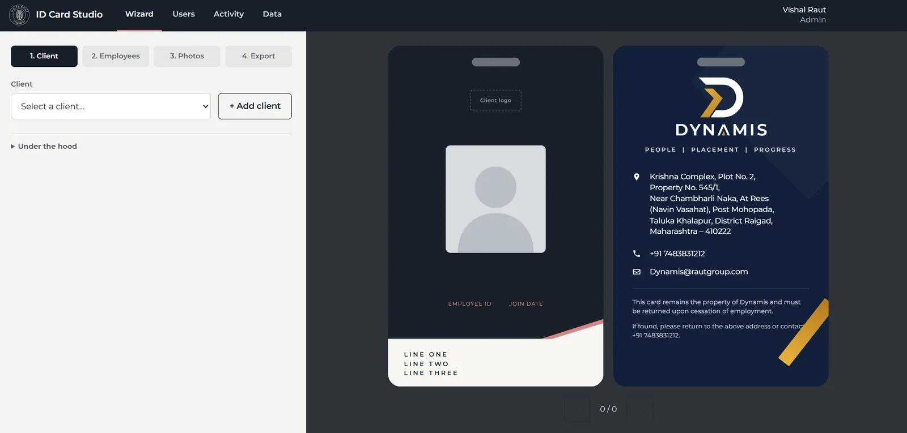

<p align="center">
  
</p>

<h1 align="center">ID Card Studio</h1>
<p align="center">Print-ready ID cards, made on your own network.</p>

<p align="center">
  <a href="https://drvishalraut-eng.github.io/id-card-studio/">Website</a> ·
  <a href="https://github.com/drvishalraut-eng/id-card-studio/releases/latest">Download</a>
</p>



---
© White Coat Foundry


# ID Card Studio

A portable, LAN-hosted ID card generator for Dynamis staff to make photo ID
cards for employees placed at client companies, and export print-ready
PDFs.

The whole app is a single self-contained binary: Go on the backend
(standard library only), vanilla JS/HTML/CSS on the frontend (no build
step), embedded via `go:embed`. Copy the binary anywhere — a laptop, a
shared drive, a USB stick — and run it.

## Quick start

1. Download or build the binary for your platform (see [Building](#building)).
2. Put it in its own folder, e.g. `ID-Card-Studio/idcard.exe`.
3. Double-click it (or run it from a terminal). It creates `config.json`
   and a `data/` folder next to itself on first run, prints every LAN URL
   it's listening on, and opens your browser automatically.
4. The first time anyone visits, they'll see a setup screen to create the
   first Admin account. Everyone else signs in with a username and PIN.

## Prerequisites (for building from source)

- Go 1.24 or newer
- Git
- Python 3 with `openpyxl` (only needed to regenerate the Excel template:
  `pip install --user openpyxl`)
- `curl` or PowerShell (only needed to re-fetch vendored frontend libraries)

## Building

```sh
# macOS/Linux
./scripts/build.sh

# Windows
./scripts/build.ps1
```

Both scripts run `go vet` and the full test suite first, then cross-compile
into `dist/<os>-<arch>/idcard(.exe)` — one ready-to-copy folder per
platform:

- `dist/windows-amd64/idcard.exe`
- `dist/darwin-arm64/idcard` (Apple Silicon)
- `dist/darwin-amd64/idcard` (Intel Mac)
- `dist/linux-amd64/idcard`

Copy the whole folder for your platform wherever you want to run it from.

### macOS: building a .dmg

`scripts/build.sh` only produces raw binaries. If you want a `.dmg` to
hand to a Mac user, run this **on a Mac** (it shells out to `hdiutil`,
which only exists on macOS):

```sh
./scripts/make_dmg.sh
```

This builds both `dist/darwin-arm64` and `dist/darwin-amd64` if they're
missing, then packages them into `dist/ID-Card-Studio.dmg` with a
"Read me first.txt" covering the Gatekeeper step below.

### Re-vendoring frontend libraries

`web/vendor/` (html-to-image, jsPDF, JSZip, SheetJS, and the Montserrat/
Josefin Sans fonts) and `web/assets/employees_template.xlsx` are committed
to the repo, so a normal build needs only Go. If you ever need to
re-fetch them (e.g. to bump a pinned version):

```sh
./scripts/vendor.sh          # or vendor.ps1 on Windows
python3 scripts/make_template.py
```

## Running on a LAN

On start, the server prints every LAN URL it's reachable at (one per
network interface) and opens the host machine's browser to it
automatically. Anyone else on the same network can open one of those
printed URLs (e.g. `http://192.168.1.42:8080`) directly — no installation
needed on their end, just a browser.

`config.json` (created on first run, next to the binary) controls the
port and whether to auto-open a browser:

```json
{ "port": 8080, "export_dir": "~/Desktop/ID Cards", "open_browser": true }
```

Multiple people can use the app at the same time from different
computers; every write to the shared data is mutex-protected and atomic.

## Backing up

The easiest way: sign in as an Admin, open the **Data** tab, and click
**Export backup** — it downloads every client, employee, user, photo and
client logo as one zip file. The same page can **Import backup** (replaces
everything with a chosen backup's contents and signs everyone out) or
**Clear all data** (wipes everything back to a fresh install, reseeding
Helios). Both are destructive and ask for a confirmation first.

Everything the app knows lives under the `data/` folder next to the
binary, so you can also back up or move the app to another machine by
copying that folder directly (and `config.json`, if you want to keep the
same settings) — useful if you'd rather keep `config.json`'s port and
export-folder settings, which the in-app export doesn't include. There's
no database to export.

```
ID-Card-Studio/
├── idcard(.exe)
├── config.json
└── data/
    ├── clients.json
    ├── employees.json
    ├── users.json
    ├── activity.jsonl
    ├── logos/<client_id>.svg
    └── photos/<employee_id>.jpg
```

## A note for Windows users: OneDrive and the Desktop

The default export folder is `~/Desktop/ID Cards`. On many Windows PCs,
"Desktop" is actually redirected into OneDrive (Settings → Sync and
back up → Manage backup, or an IT policy). That's usually fine, but it
means:

- Exported PDFs will sync to OneDrive automatically, which can be slow
  for a large batch export, or briefly show a file as "syncing" before
  it's available elsewhere.
- If OneDrive is paused, disconnected, or over its storage quota,
  exports can appear to succeed locally but not show up on other
  devices until it catches up.

If you'd rather export somewhere that isn't synced, change `export_dir`
in `config.json` to a plain local path (e.g. `C:\\ID Card Exports`) and
restart the app.

## Troubleshooting

**The app won't start / "port already in use".**
Another program (or another copy of ID Card Studio) is already using
that port. Either close it, or change `"port"` in `config.json` and
restart.

**Nobody else on the network can reach it.**
Check the LAN URLs the server printed on start match the network the
other computer is on, and that no firewall is blocking inbound
connections to that port on the host machine.

**A browser didn't open automatically.**
Set `"open_browser": true` in `config.json` if it's been turned off, or
just open one of the printed LAN URLs manually.

**"Sign in to continue" / "missing X-Requested-With: idcard header" errors
in the browser console.**
This usually means something intercepted or modified the request (an
aggressive browser extension or corporate proxy). Try a different
browser or disable extensions for this site.

**An account got locked out.**
After 5 failed PIN attempts, an account locks for 5 minutes. An Admin
can also reset that user's PIN from the Users page at any time, which
clears the lockout immediately.

**I don't see the Users, Data or Activity tab.**
Activity is visible to everyone; Users and Data are Admin-only — ask an
existing Admin to add your account with the Admin role, or to check the
Users page for your account's role.

**macOS says `"idcard" Not Opened` / "Apple could not verify... is free of
malware".**
This is Gatekeeper, not a bug — the binary isn't signed by an Apple
Developer account. Click **Done**, then open **System Settings → Privacy
& Security**, scroll to the `"idcard" was blocked` line, and click **Open
Anyway**. Run it again and confirm **Open** on the second dialog. (Or run
`xattr -d com.apple.quarantine /path/to/idcard` in Terminal.) You only
need to do this once per machine.

**On macOS, double-clicking `idcard` opens it as garbled text (e.g. in
TextEdit) instead of running it.**
The executable permission was lost in transfer (common after downloading
via a browser, WhatsApp, or an archive tool that doesn't preserve Unix
permissions). Run it from Terminal instead:
```sh
cd /path/to/folder/with/idcard
chmod +x idcard
./idcard
```
After that, double-clicking it should work normally too.

**Cards look wrong / a client's logo doesn't show.**
Client logos must be clean SVG (no `<text>`, no embedded images or
scripts — the app validates this on upload and explains what's wrong).
If reference/index.html is available, compare the card visually against
it — that file is the approved layout reference.

## License

Internal tool for Dynamis. Vendored third-party libraries (in
`web/vendor/`) keep their own licenses: html-to-image, jsPDF, JSZip and
SheetJS are MIT/Apache-2.0; Montserrat and Josefin Sans are OFL-1.1.
